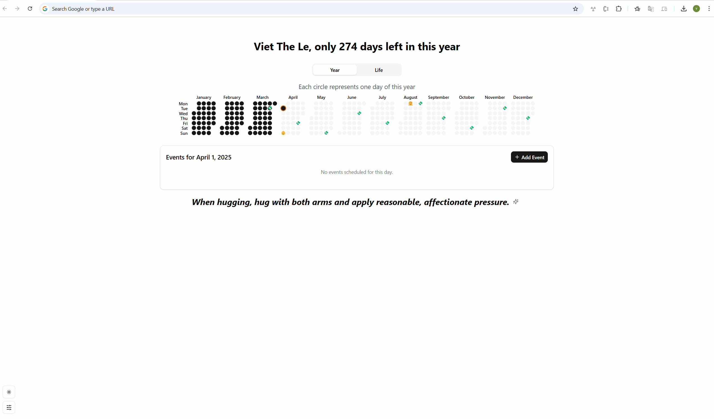

# Life Calendar Extension

A modern calendar and event tracking extension with a clean, intuitive interface.

## ✨ Features

- **New Tab Integration** - Calendar opens automatically in new browser tabs
- **Annual Overview** - Interactive yearly calendar with visual event indicators
- **Flexible Event Management** - Support for one-time and recurring events (weekly/monthly)
- **Responsive Design** - Smooth animations and intuitive user interface
- **Appearance Options** - Toggle between light and dark themes
- **Quick Information** - Hover tooltips for instant event preview

## Demo


## 🚀 Getting Started
**Prerequisites**
- Node.js (v18 or newer recommended)
- pnpm

**Installation**
```shell
# Clone the repository
git clone https://github.com/LETHEVIET/life-calendar-extension.git

# Navigate to the project directory
cd life-calendar-extension

# Install dependencies
pnpm install
```
**Development**
```shell
pnpm run dev
```
**Building for Production**
```shell
pnpm vite build
```
## 🛠️ Tech Stack
- **React** - UI library
- **TypeScript** - Type safety
- **Vite** - Build tool
- **TailwindCSS** - Styling
- **Motion** - Animations
- **Shadcn** - Component library
- **pqoqubbw/icons** - Beautifully crafted animated icons
- **quotes** - [Advice Slip JSON API](https://api.adviceslip.com/)

## 📖 Usage
The extension provides a yearly calendar view where users can:

- Add and manage events
- View event details through tooltips
- Track recurring events
- Switch between light and dark themes

## 🤝 Contributing
Contributions, issues, and feature requests are welcome!

## 📄 License
This project is licensed under the MIT License - see the LICENSE file for details.

## Acknowledgments & Inspiration
This project draws inspiration from several excellent works in the calendar and productivity space:
- The [The Last Sunday: reminder of life rushing by](https://chromewebstore.google.com/detail/the-last-sunday-reminder/aiojhapcgfgmiacbbjfgedhlcchmpelh) by [@paraschopra](https://x.com/paraschopra)
- The design philosophy borrows elements from modern calendar applications while emphasizing simplicity and visual clarity.
- Special thanks to the open-source community whose libraries and frameworks made this project possible.